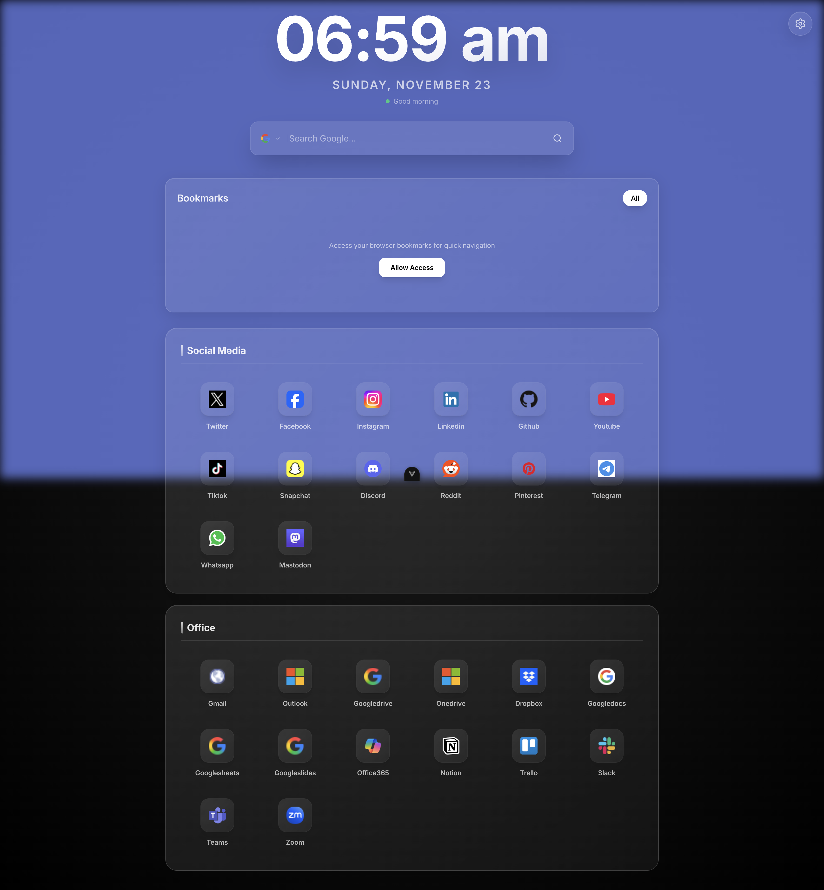

<div align="center">

# CUSTOM NEW TAB

_Transform your browsing experience with a beautifully crafted dashboard_


**Built with the tools and technologies:**


</div>

## Overview

Custom New Tab is a modern browser extension that transforms your new tab experience into a productive and inspiring dashboard. Built with Vue.js and TypeScript, it offers a seamless blend of functionality and aesthetic appeal with real-time updates, universal search capabilities, and quick access to essential web applications.

## Key Features

- **🕐 Real-time Clock & Date** - Elegant time display that updates every second
- **🔍 Universal Search** - Integrated search across Google, DuckDuckGo, and Bing
- **📱 Quick App Access** - One-click shortcuts to Google and Microsoft productivity apps
- **💡 Daily Inspiration** - Curated motivational quotes powered by external APIs
- **🎨 Modern Design** - Beautiful gradient backgrounds with glass morphism effects
- **⚡ Lightning Fast** - Built with Vite for optimal performance and quick loading

## Screenshots

### Dashboard Overview

Below is a full-page capture of the extension running locally during development. It showcases the clock, search bar, bookmarks, and categorized website shortcuts with the glass morphism UI.



### Accessibility Snapshot (Structural Outline)

An excerpt of the accessibility tree (captured via Chrome DevTools MCP) demonstrates semantic structure and interactive elements:

```
RootWebArea "New Tab" url="http://localhost:5173/"
   button "Open settings"
   text "06:59 am" | text "SUNDAY, NOVEMBER 23" | text "Good morning"
   button "Change search engine" + textbox "Search Google..." + button "Search"
   heading "Bookmarks" (level 2)
   button "All" + description text
   Social Media links (Twitter, Facebook, Instagram, LinkedIn, Github, Youtube, etc.)
   Office links (Gmail, Outlook, Drive, OneDrive, Dropbox, Docs, Sheets, Slides, Office365, Notion, Trello, Slack, Teams, Zoom)
```

The full raw snapshot is stored at `public/screenshots/ui-snapshot.txt` for reference.

## Tech Stack

- **Frontend:** Vue.js 3, TypeScript, Tailwind CSS 4
- **Build Tool:** Vite 7
- **Package Manager:** pnpm
- **Code Quality:** ESLint, Prettier, Oxlint
- **Browser APIs:** Chrome Extensions Manifest V3

## Setup

### Prerequisites

- **Node.js** (^20.19.0 || >=22.12.0)
- **pnpm** package manager

### Installation

1. **Clone the Repository**

   ```bash
   git clone https://github.com/razeevascx/new-tab.git
   ```

2. **Navigate to Project**

   ```bash
   cd new-tab
   ```

3. **Install Dependencies**

   ```bash
   pnpm install
   ```

4. **Start Development Server**

   ```bash
   pnpm dev
   ```

5. **Build for Production**

   ```bash
   pnpm build-extension
   ```

6. **Verify Installation**
   - Development: Open http://localhost:5173
   - Production: Load the `dist` folder as unpacked extension

## Browser Installation

### Chrome/Edge/Brave

1. **Build the Extension**

   ```bash
   pnpm build-extension
   ```

2. **Open Extensions Page**
   - Chrome: Navigate to `chrome://extensions/`
   - Edge: Navigate to `edge://extensions/`
   - Brave: Navigate to `brave://extensions/`

3. **Enable Developer Mode**
   - Toggle the "Developer mode" switch in the top-right corner

4. **Load Extension**
   - Click "Load unpacked" button
   - Select the `dist` folder from your project directory

5. **Activate**
   - Open a new tab to experience your custom dashboard

### Firefox

1. **Build the Extension**

   ```bash
   pnpm build-extension
   ```

2. **Access Debug Page**
   - Navigate to `about:debugging#/runtime/this-firefox`

3. **Load Temporary Extension**
   - Click "Load Temporary Add-on"
   - Select `manifest.json` from the `dist` folder

## Customization

### App Configuration

The extension uses JSON-based configuration for easy app management:

**Google Apps** (`src/data/google-apps.json`)

```json
{
  "name": "Gmail",
  "url": "https://mail.google.com",
  "icon": "📧",
  "color": "#EA4335"
}
```

**Microsoft Apps** (`src/data/microsoft-apps.json`)

```json
{
  "name": "Outlook",
  "url": "https://outlook.live.com",
  "icon": "📧",
  "color": "#0078D4"
}
```

### Search Engine Configuration

Modify search engines in `src/components/SearchBar.vue`:

```typescript
const searchEngines: SearchEngine[] = [
  { name: 'Google', url: 'https://www.google.com/search?q=' },
  { name: 'DuckDuckGo', url: 'https://duckduckgo.com/?q=' },
  { name: 'Your Engine', url: 'https://example.com/search?q=' },
]
```

### Visual Customization

- **Background Gradients**: Edit `src/components/Main.vue`
- **Component Styling**: Modify individual Vue components
- **Color Scheme**: Update Tailwind CSS classes throughout the project

## Development Commands

| Command                  | Description                              |
| ------------------------ | ---------------------------------------- |
| `pnpm dev`               | Start development server with hot reload |
| `pnpm build-extension`   | Build optimized extension for production |
| `pnpm package-extension` | Create distributable ZIP file            |
| `pnpm lint`              | Run code linting with ESLint and Oxlint  |
| `pnpm format`            | Format code using Prettier               |
| `pnpm type-check`        | Perform TypeScript type checking         |

## Project Architecture

### Core Components

| Component         | Purpose                  | Key Features                                    |
| ----------------- | ------------------------ | ----------------------------------------------- |
| **App.vue**       | Main application wrapper | Vue app initialization and global layout        |
| **Main.vue**      | Dashboard layout         | Responsive grid system and gradient backgrounds |
| **Clock.vue**     | Time display             | Real-time updates with 24-hour format           |
| **SearchBar.vue** | Search interface         | Multi-engine support with clean UI              |
| **Websites.vue**  | App launcher grid        | Dynamic app loading from JSON configuration     |
| **Quote.vue**     | Inspirational content    | API integration with fallback quotes            |
| **Bookmarks.vue** | Browser bookmarks        | Quick access to saved sites                     |

### Data Structure

```
src/data/
├── google-apps.json     # Google workspace applications
├── microsoft-apps.json  # Microsoft 365 applications
├── Website.ts           # TypeScript interfaces
└── README.md           # Configuration documentation
```

### Browser Permissions

The extension requires minimal permissions for optimal security:

- **`storage`** - Save user preferences and settings
- **`bookmarks`** (optional) - Access browser bookmarks for quick navigation

## Troubleshooting

### Common Issues

**Extension Not Loading**

- Verify `manifest.json` exists in the `dist` folder
- Check browser developer console for error messages
- Ensure all build artifacts are present in `dist/`

**Search Functionality Issues**

- Confirm network connectivity
- Verify search engine URLs are accessible
- Check for browser security restrictions

**Quotes Not Displaying**

- Extension includes fallback quotes for offline scenarios
- Check network connection for API access
- Verify CORS policies allow external API calls

**Development Server Issues**

```bash
# Clear cache and reinstall dependencies
rm -rf node_modules pnpm-lock.yaml
pnpm install
pnpm dev
```

## Contributing

We welcome contributions from the community! Here's how you can help improve Custom New Tab:

### 1. Report Issues

- Create a [new issue](https://github.com/razeevascx/new-tab/issues) with detailed reproduction steps
- Include browser version, operating system, and error messages
- Attach screenshots or screen recordings when relevant

### 2. Suggest Features

- Use our issue tracker to propose new functionality
- Describe the problem you're solving and your proposed solution
- Consider the impact on existing users and extension performance

### 3. Submit Code Changes

1. Fork the repository to your GitHub account
2. Create a feature branch (`git checkout -b feature/awesome-feature`)
3. Make your changes with clear, descriptive commit messages
4. Run quality checks (`pnpm lint && pnpm type-check`)
5. Test the extension in multiple browsers
6. Push to your fork (`git push origin feature/awesome-feature`)
7. Open a Pull Request with a detailed description

### Development Guidelines

- Follow existing code style and conventions
- Add TypeScript types for new functionality
- Update documentation for user-facing changes
- Test across Chrome, Edge, and Firefox when possible

## Support & Community

- **GitHub Issues**: [Report bugs and request features](https://github.com/razeevascx/new-tab/issues)
- **Repository**: [Source code and documentation](https://github.com/razeevascx/new-tab)
- **Discussions**: Use GitHub Discussions for general questions and ideas

**Maintenance Status**: This project is actively maintained. Expect responses to issues within 72 hours during weekdays.

---

**Built with Vue 3, TypeScript, Tailwind CSS, and Vite** | _Crafted for productivity and inspiration_
